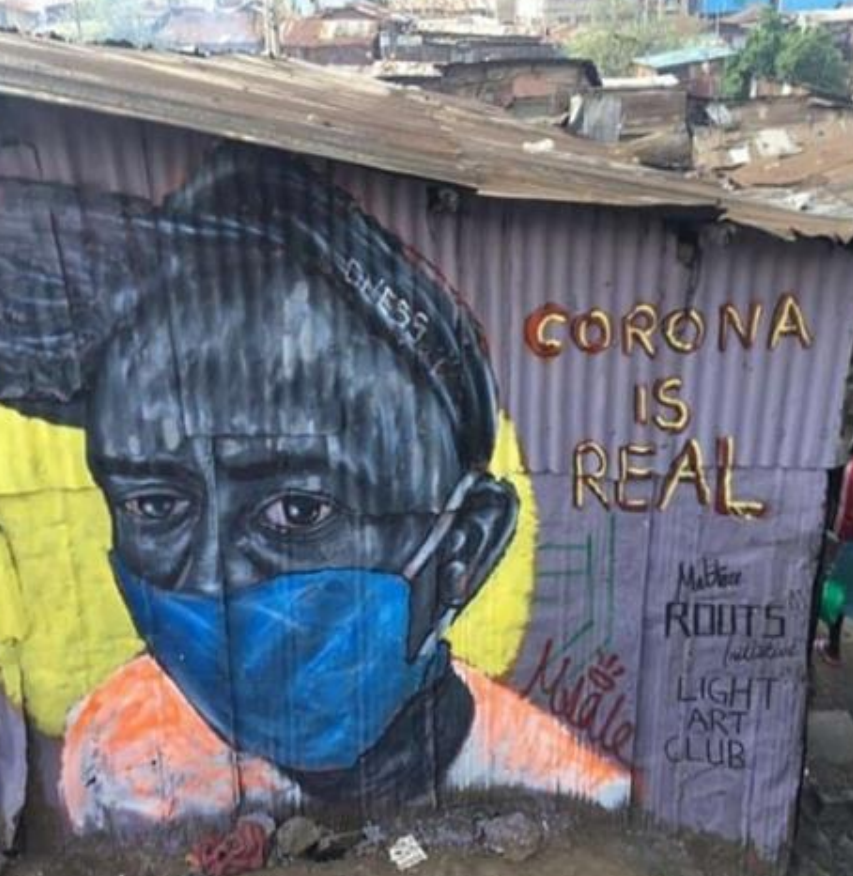

*New Network Facilitates Information Collection and Exchange of Worldwide COVID-19 Data for Researchers and Policy Makers*

According to the World Health Organization (WHO), more than 11,000 deaths were reported during the 2014-2016 Ebola outbreak in West Africa. However, the WHO also noted that additional deaths likely occurred and were not recorded due to substantial healthcare challenges in the region.

In an effort to improve virus data sharing in Africa and around the world, the [GO FAIR Initiative](https://www.go-fair.org/) recently announced the formation of the latest Implementation Network: the Virus Outbreak Data Network ([VODAN](https://www.go-fair.org/implementation-networks/overview/vodan/)) initiative. The West Big Data Innovation Hub helped debut VODAN this summer by hosting a series of virtual talks that highlighted the role of data science and FAIR data in the fight against COVID-19.

“The current pandemic illustrates the need for continuous and near-real time data updates from a number of field locations. Our short-term goal with VODAN is to create ways for collecting and sharing COVID-19 information in place, which can then be integrated with other data sources for visibility of the virus across broad regions and borders,” said Christine Kirkpatrick, division director of Research Data Services at the San Diego Supercomputer Center and West Hub Deputy Director. “For example, it is possible for a rural clinic to stand up a data point that shares limited, summary information about the patients being treated, and more detail with trusted partners, such as governmental health organizations. This allows a country and/or county-wide data stewards and scientists to look across the data points and more quickly draw inferences to inform policy makers and health officials’ decisions.”

Additional data, or metadata that describes what is available, can be collected alongside the clinical data including economic and social data. This is especially important for “thinking about _after_ Covid-19,” according to Her Excellency, Julia Duncan Cassell, previously Minister of Gender and Development for the Republic of Liberia, who called for information to be collected to track alcoholism and domestic violence alongside the virus’s health effects.

“VODAN at large is about using these datasets and programs that we have built up for 1) awareness of the need for machine readable/actionable data, 2) the need to train more data stewards, and 3) the need to change the paradigm from ‘I’ll collect all the data in a lake’ to ‘let my algorithm visit your data’,” explained Kirkpatrick, who also founded and heads the US Coordination Office for the GO FAIR Initiative.

*Image 1 Caption: The VODAN FAIR Data Point (FDP) is developed within the VODAN (Virus Outbreak Data Network) implementation network. With a VODAN FDP, organizations across the world can publish their metadata about virus outbreak datasets. Credit: Luiz Olavo Bonino*

## VODAN-Africa Leads Training Efforts for Multiple Sites

Key GO FAIR leaders, including Dr. Barend Mons and Prof. Dr. Mirjam van Reisen, previously conducted research on the African continent related to malaria and the Ebola crisis respectively. Determined to not repeat past practices where infrastructure and data was removed following the Ebola crisis, several institutions have teamed, with support from Philips Foundation, on the formation of [VODAN-Africa](https://www.vodan-totafrica.info/) to address undetected infection and spread of viruses, beginning with COVID-19. VODAN-Africa is chaired by Dr. Mouhamad Mpezamihigo with Dr. Francisca Oladipo who serves as Executive Director.  Both are located at Kampala International University in Uganda. 

Building upon lessons learned from the Ebola crisis, VODAN-Africa created a training system to identify and train data stewards.  These stewards work with local hospitals, clinics, and information sources to stand up data points.  Healthcare teams input COVID-19 data (after it is stripped of private personal information) using preset templates that ensure information is entered with common languages and standards, so it can be easily summarized.  Individual country partners in VODAN-Africa can ‘collect’ summaries of the data by virtual visits to the data, rather than waiting for it to be transmitted to a central location.

“VODAN is open to both public and private entities who commit to the GO FAIR principles of findable, accessible, interoperable, and reusable data assets for both humans and machines,” said Dr. Barend Mons, founder of the GO FAIR Initiative. “Large amounts of data are being generated related to COVID-19 and we created VODAN to enable computational access for analysis and visualization – focusing a number of our efforts on Africa as this area faces difficulties that could be greatly assisted by projects like VODAN-Africa.”

VODAN-Africa already has several countries on board with collecting and disseminating information, which is then stored in area Fair Data Points (FDPs). Currently, there are 14 FDPs throughout Africa.

“We are pleased to be involved with VODAN-Africa – not only for the current pandemic of COVID-19,” said Oladipo. “But to also prepare for future such situations in our country and our continent.”

*Image 2 Caption: Street art in Kenya has played a pivotal role in community education regarding the worldwide COVID-19 pandemic. VODAN-Africa aims to help collect and disseminate pandemic data. Credit: Dr. Ali Asma*

## About the West Big Data Innovation Hub

Funded by the National Science Foundation, the West Big Data Innovation Hub’s mission is to build and strengthen partnerships across industry, academia, nonprofits, and government to address societal and scientific challenges, spur economic development, and foster a national big data ecosystem. The West Hub serves the thirteen western states from Montana to New Mexico and everything west, including Hawaii and Alaska. The Hub’s projects, events, activities, and initiatives span regional thematic areas as well as cross-cutting topics. Thematic areas include metro/urban data science as well as natural resources and hazards with a particular focus on water. Cross-cutting areas include cloud computing, data challenges and storytelling communities of practice, public policy and ethics, responsible data science, security, and data sharing. The West Big Data Innovation Hub is supported by the National Science Foundation through Awards 1550312, 1550224, and 1550328.

## Media Contact

Kimberly Mann Bruch, West Big Data Innovation Hub, [kbruch@sdsc.edu](mailto:kbruch@sdsc.edu)

## Related Links

GO FAIR Initiative: [https://go-fair.org](https://go-fair.org/)

GO FAIR US: [http://www.gofair.us](http://www.gofair.us) 

VODAN: [https://www.go-fair.org/implementation-networks/overview/vodan/](https://www.go-fair.org/implementation-networks/overview/vodan/)

VODAN-Africa: [https://www.vodan-totafrica.info/](https://www.vodan-totafrica.info/)

West Big Data Innovation Hub: [https://westbigdatahub.org](https://westbigdatahub.org/)

National Science Foundation: [https://www.nsf.gov/](https://www.nsf.gov/)

 
